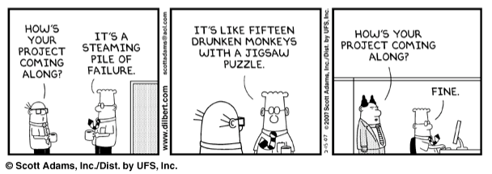

# Wearably: an eCommerce group project

Hi and thank you for taking the time to look at this repo! You ought to know that this repo was created in the context of the Concordia Web Dev bootcamp and that before this bootcamp, I had absolutely 0 experience in coding.

That being said, the next few lines will elaborate on what the project.

Now, if you're a fellow developper just wandering about, feel free to send me some notes on my code and maybe some "best practices" that I could apply in it. I think the most important sections of this read me will be the functionality one and technical problems encountered.

If you're a recruiter scouting this page to see if my code is worthy of the company you're representing, I hope you enjoy!

If you're neither of these, what are you doing on github? let me know if you have questions, which you probably will !

In any case, enjoy.

**Important note here: This readMe is a WIP, don't jugde too harshly.**

I would also like to take a moment to thank all of my teammates -Xarah, Anthony, Mariana- without whom this project would've never seen the day.

## The project context

This project was realized by a team of four junior full stack dev with close to no experience beside the bootcamp.
We communicated through Discord and all worked on different branches of the project, merging with the authorisation of everyone.

We had 6 days, including a weekend, to built this app from almost scratch. I'm saying almost because the bootcamp instructor provided us with a repo containning a React client, an Express server and a Readme containing the infos we needed.

The Minimum Viable Product that was asked of us can be resumed by: create an eCommerce app with a working Cart logic. The complete MVP asked of us can be found at the very end of this readMe. We also had to use a Reducer and the cart had to be stored in the backend and not the frontend to keep it private.

We used the MERN stack (Mongo, Express, React, Node) to build to whole thing and we were provided with data that we had to import to mongo to work the website.

## The organisation - my part in this

On the first day of the project we took a few hours to "draw" the skeleton of the app and split the tasks.

Everybody worked on everything but I was mostly responsible for the Cart reducer as well as the cart component and the logic behind those.
It is where you'll find most of my work but I am able to explain everything in this project.

## the functionalities

Here;s what we put into this app:

- A clickable carroussel showcasing 3 products, linking to the all products page.
- A suggestions component with 8 random suggestions.
- A search bar, keyboard responsive, can be clicked to access a product detail page.
- A Header with links to the other page as well as the stae of the cart.
- A subheader allowing the user to quickly access any categories
- A onSale state on the products that reduce their prices randomly
- Pagination on the all product page.
- A cart that is stored in the back end, you can close and reopen the app, the cart will be there.
- You can add and remove product from the cart as well as from all the details page.
- The cart will give you your total and updates if the cart changes.
- You can place your order, fill in your infos and order what is in your cart.
-

## A few mistakes

It wouldn't be good without a few of those ;)

- We have a product context that imports all the products making the website heavy. We should've imported what we needed when we needed it.
- Following with the first point, everytime we use a product object, we filter through the products array instead of fetching one object.
- Our random sale change everytime we rerender the product context, thats a small fix but for now it's a small mistake.
-

## Difficulties

Since this was our first project, all at a distance at that, we encountered a few challenges.

The first one being we had trouble adjusting to working as a team. It was our first time, it was hard to take effective decisions and also learning to work with github as a team was totally new for us.

The second one was me designing the reducer for the cart way too fast and having to redo it all over again a few times. Now part of the reducer isn't even useful but is kept there becuase it rerenders the fetch for the cart.

## The original instructions

##### this section is the exact copy paste of the instruction given to us. I left it there only to be 100% transparent.

You've and your team have been hired by a client to create an e-commerce website that will showcase wearable technology. The client believes that wearable tech is the way of the future!

Your job will be to build a functional e-commerce website where users can come in and shop around for the tech they want.

---

## Getting Started

You have your assignment and your team. What should you do first? This will vary for every team, and even every team member.

> **The important thing is to NOT just jump in and start coding!**

A good brainstorming session is **STRONGLY** recommended! Plan out together :

- What it will look like.
- How it will behave.
- What features you want to have.
- What stretch goals you want to aim for.
- etc...

There probably shouldn't be any coding until a skeleton has been planned out.

---

## Meet your Product Manager!

Each team has been assigned a product manager!

- This person is in charge of answering questions, guiding you and basically preventing everything from falling apart!
- This person will be directing a team stand-up every day.
  - A stand-up is a meeting that lasts around 10 to 15 minutes where each member of the team updates the PM (and other members) about their progress or problems they're facing.

---

## MVP

You have plenty of freedom in how the app will look and behave. As long as you meet the MVP requirements below, your poject will be deemed successful! You are allowed to use external UI libraries to build some nice functionality.

> **✋ You CANNOT use any external styling libraries, including, but not limited to, Material UI, Bootstrap, and Tailwind to style your project!**

## Frontend

Users should be able to:

- View all items in the database.
- Purchase items that are in stock.
- View their cart containing the items they intend to purchase.
  - The cart **CANNOT** use `sessionStorage` or `localStorage`, and must be persistent.
  - **HINT**: use the database. Yes it will be slow, but use it anyways.
- Edit the cart before completing the purchase.
  - **HINT**: use a reducer.

## Backend Requirements

The Node server should

- Be RESTful (use the right `method` for the right job and hold nothing in memory).
- Provide the FE with the required data in a clear and organized way.
- Update the database as users make purchases.

## Code Requirements

That's right! We're dropping code requirements on you!

- No console logs! _Unless they are part of a catch (logging an error)._
- Comments! Comments everywhere!
  - Every function should have a comment above it that briefly explains what it does.
    - Remember: a component is a function!
  - Any large / complex block of code should have comments above it that briefly explain what it's doing.
  - Variables should have comments explaing what they're for. **_Especially if there are many with similar names or the name isn't very clear._**
- Organization! No file should be several hundred lines long! Split your code up into different files.
- No bugs! (In a perfect world this would be possible. For now, try to minimize them).

## Project Requirements

You thought we were done? Oh there's more!

- Attendance to the daily stand-ups conducted by your PM.
- A [Trello](https://trello.com) board to divide up the tasks (other similar sites are fine too).
- A group chat or new private discord server for your team and your PM.

## Stretch Goals

Yeup!

> For this project, stretch goals are highly recommended (though not necessary)!

The MVP for this project is small; in fact it's tiny. We strongly encourage you to flex your skills and build something cool and functional!

Make use of any and all libraries (except styling libraries) you can get your hands on if you think it will make the user's experience on your website better!

---

## About the Data

All about Wearables!
You will find 349 items in the `_data/items.json` file. The data is mostly clean, but there could be some irregularities, i.e. empty values, values that we really don't need. _This is common in large databases, and something that we have to deal with._

> No modifying the data at all. We use what we get!

### Item Object

```js
  {
    "name": "Barska GB12166 Fitness Watch with Heart Rate Monitor",
    "price": "$49.99",
    "body_location": "Wrist",
    "category": "Fitness",
    "id": 6543,
    "imageSrc": "data:image/jpeg;base64,/9j/4AAQSkZJRgABAQAAAQABAAD/2wCEAAkGBwgHB...<REST_OF_IMAGE_ENCODING>",
    "numInStock": 9,
    "companyId": 19962
  },
```

### Company Object

```js
  {
    "name": "Barska",
    "url": "http://www.barska.com/",
    "country": "United States",
    "id": 19962
  }
```

---

## 🤣 Don't be this guy...



---

## Working as a team

Use the [Group Project Step by Step Instructions](https://docs.google.com/document/d/1Txc02kMSnTjyOWFj3HDXc5y5tSurt3AFJGpXZKxvX6A/edit?usp=sharing)

---

## Presentation

Your team will have to present the final product on the final day in order to get a passing grade. Who will draw the short straw?

- The presentation shouldn't be more than 5 mintues long.
